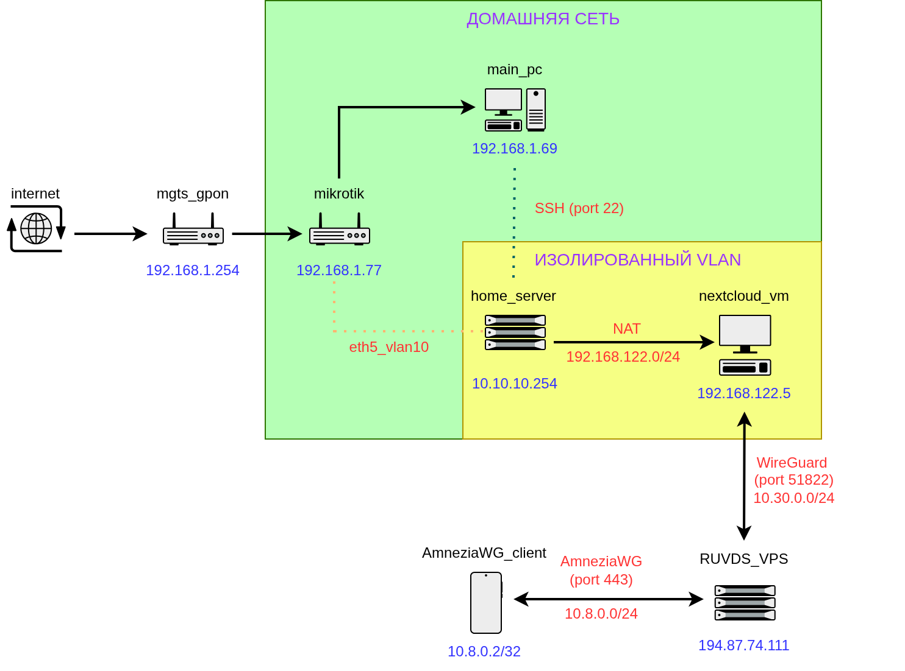

# Проект: Семейный облачный сервер с Nextcloud и защищённым доступом через AmneziaWG

Проект напрямую связан и является продолжением первого проекта по сборке и настройке домашнего сервера. Смотреть здесь: https://github.com/jetpackfm/mpd_server

## Цель

Настроить на домашнем сервере личное хранилище файлов **(Nextcloud)** и организовать текстовый чат для членов семьи (Nextcloud Talk с отключёнными видеозвонками). Так же, для создания изолированного личного пространства было решено вынести Nextcloud (Docker-стек: PostgreSQL, Redis, Nextcloud, Talk, OnlyOffice) за **WireGuard**. Сам сервер уже находится в изоляции через настройки MikroTik (подробнее в предыдущем руководстве). В данной схеме доступ к серверу организован через VPS и WireGuard, установленный непосредственно на виртуальную машину. MikroTik остаётся только для изоляции VLAN и раздачи интернета, но не участвует в маршрутизации VPN-трафика. Это упрощает настройку и обходит ограничения, связанные с режимом моста на MikroTik. 

> [!IMPORTANT]
> **Важно!** Стоит отметить, что, в моем случае, проекту были необходимы дополнительные финансовые затраты (покупка ресурсов на сервисе **RUVDS** (https://ruvds.com/)). Был выбран [**RUVDS**](https://ruvds.com/) из-за поминутной тарификации и возможности динамического выделения RAM (ballooning), что позволяет платить только за реально использованные ресурсы.

> [!TIP]
> **Примечание:** В тексте используется термин VPS (Virtual Private Server). RUVDS — название хостинг-провайдера, у которого арендован VPS.

## Используемые технологии

- **AmneziaWG** — обфусцированный WireGuard
- **RUVDS** — VPS с поминутной оплатой
- **KVM + libvirt** — виртуализация на хосте
- **Docker** — контейнеризация Nextcloud
- **PostgreSQL + Redis** — база данных и кэш

## Требования

- Хост с Linux Mint (или любая система с KVM)
- Минимум 4 ГБ RAM для ВМ
- Минимум 50 ГБ свободного места на диске
- Внешний VPS с белым IP

## Результат

После выполнения всех глав вы получите:
- Семейный облачный сервер с доступом через защищённый VPN-туннель
- Текстовый чат (Nextcloud Talk) без видеозвонков
- Полностью изолированную инфраструктуру

## Архитектура сети

*Схема сети: глобальный интернет, роутер провайдера, MikroTik, изолированный сервер, VPS и VPN-туннели.*

# Содержание

- [1. RUVDS и AmneziaWG](docs/chapter_1.md)
- [2. Установка KVM + libvirt + virt-manager](docs/chapter_2.md)
- [3. Установка и настройка WireGuard](docs/chapter_3.md)
- [4. Развёртывание Nextcloud](docs/chapter_4.md)
- [5. Заключение](docs/conclusion.md)
