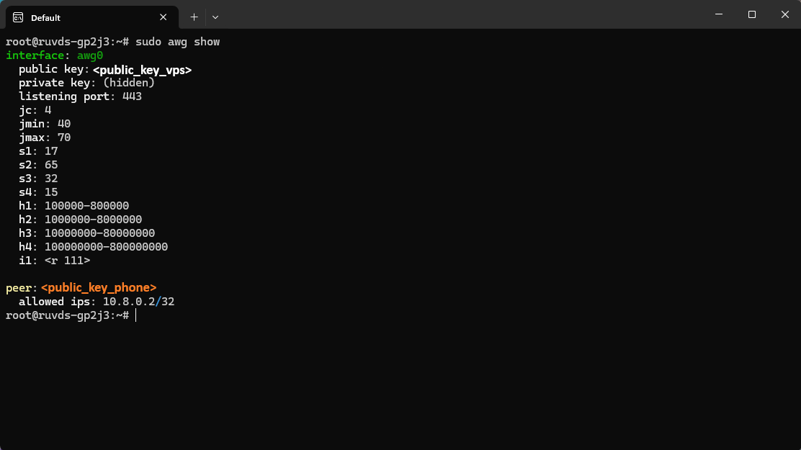
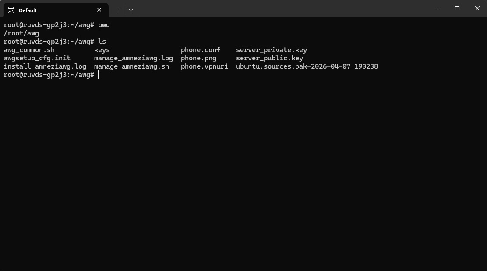
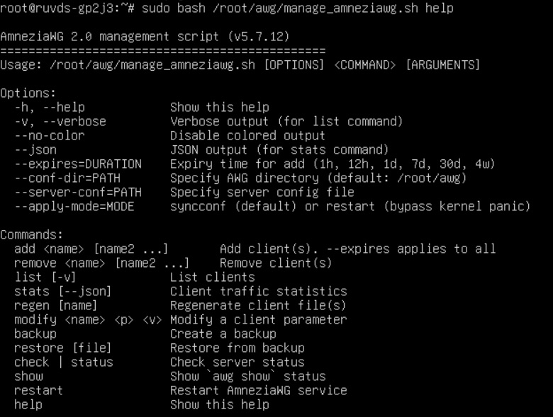

# Глава 1

## Содержание
   - [1.1 Выбор тарифа и создание сервера](#11-выбор-тарифа-и-создание-сервера)
   - [1.2 Создание SSH-ключа](#12-создание-ssh-ключа)
   - [1.3 Создание сервера на RUVDS](#13-создание-сервера-на-ruvds)
   - [1.4 Первичная настройка сервера](#14-первичная-настройка-сервера)
   - [1.5 Установка AmneziaWG](#15-установка-amneziawg)
   - [1.6 Настройка файрвола (iptables)](#16-настройка-файрвола-iptables)
   - [1.7 Проверка работы файрвола](#17-проверка-работы-файрвола)
   - [1.8 Проверка работы AmneziaWG](#18-проверка-работы-amneziawg)
   - [1.9 Оптимизация AmneziaWG](#19-оптимизация-amneziawg)
   - [1.10 Клиентские конфиги](#110-клиентские-конфиги)
   - [1.11 Управление клиентами](#111-управление-клиентами)
   - [1.12 Подключение к AmneziaWG с телефона](#112-подключение-к-amneziawg-с-телефона)

## RUVDS и AmneziaWG

### 1.1 Выбор тарифа и создание сервера

Прямой **WireGuard** на **MikroTik** оказался заблокирован DPI-системами провайдера (характерные признаки протокола — фиксированные размеры пакетов и типы сообщений). Для обхода блокировки необходим обфусцированный протокол **AmneziaWG**.
Требования к хостингу:
- Белый IPv4-адрес.
- Поминутная или почасовая оплата (проект экспериментальный, сервер не работает 24/7).
- Возможность установки AmneziaWG (Ubuntu 24.04 LTS).

Был выбран провайдер **RUVDS** из-за низкого порога входа, поминутной тарификации и динамического выделения RAM (ballooning).

### 1.2. Создание SSH-ключа

Для безопасного подключения к серверу без пароля необходимо создать SSH-ключ и добавить публичную часть в личный кабинет RUVDS.

**Для Windows (PowerShell)**

Откройте PowerShell и выполните:

```powershell
ssh-keygen -t ed25519 -C "windows-key-for-ruvds"
```

- При запросе места сохранения нажмите Enter (ключ сохранится в C:\Users\Ваше_Имя\.ssh\id_ed25519).
- При запросе парольной фразы можно нажать Enter (оставить пустой) или придумать пароль.

_Публичный ключ_ (его нужно будет скопировать) посмотрите командой:

```powershell
type $env:USERPROFILE\.ssh\id_ed25519.pub
```

**Для Linux (включая Linux Mint)**

Откройте терминал и выполните:

```bash
ssh-keygen -t ed25519 -C "linux-key-for-ruvds"
```

- При запросе места сохранения нажмите Enter (ключ сохранится в ~/.ssh/id_ed25519).
- При запросе парольной фразы можно оставить пустой.

_Публичный ключ_ посмотрите командой:

```bash
cat ~/.ssh/id_ed25519.pub
```

**Что делать с ключами**

- Публичный ключ (начинается с ssh-ed25519 AAA...) — его можно и нужно копировать на серверы и в личные кабинеты. Именно его мы добавим в RUVDS.
- Приватный ключ (id_ed25519) — никому не показывайте. Он остаётся на вашем компьютере.

### 1.3. Создание сервера на RUVDS

1. Зарегистрируйтесь на [RUVDS](https://ruvds.com/) и пополните баланс.
2. В разделе SSH-ключи нажмите «Добавить ключ», вставьте скопированный публичный ключ и сохраните.
3. Создайте сервер с параметрами:
    - ОС: Ubuntu 24.04 LTS
    - CPU: 1 ядро
    - RAM: 1–2 ГБ (в моём случае выбрано 3 ГБ, но фактически память выделяется динамически)
    - Диск: 20 ГБ HDD
    - IPv4: 1 адрес
    - Тариф: с поминутной оплатой
    - Выберите добавленный SSH-ключ при создании.
4. Дождитесь создания сервера.

**Важно о тарификации:**

- Вы платите за CPU, RAM (только когда сервер работает) и диск + IP (всегда, даже если сервер выключен). В моём случае простой обходился примерно 10 рублей в сутки.
- Команда `free -h` может показывать не весь объём RAM из тарифа, а только реально используемый — это ballooning, нормальное поведение платформы RUVDS. Память «подтягивается» автоматически при росте потребления.

### 1.4. Первичная настройка сервера

Подключитесь к серверу по **SSH** (пароль не потребуется, так как мы добавили ключ):

```bash
ssh root@<IP_вашего_сервера>
```

Выполните базовые проверки:

```bash
# версия ОС
lsb_release -a

# Память (будет меньше тарифной — это нормально)
free -h

# Диск
df -h

# Сеть
ip a
```

Обновите систему:

```bash
apt update && apt upgrade -y
```

### 1.5. Установка AmneziaWG

Используется официальный скрипт установки (поддерживает **Ubuntu 24.04,** на 22.04 возможны проблемы с совместимостью ядра, поэтому рекомендуется использовать **свежую версию ОС**).

```bash
apt install -y wget curl build-essential

wget https://raw.githubusercontent.com/bivlked/amneziawg-installer/main/install_amneziawg_en.sh

chmod +x install_amneziawg_en.sh

./install_amneziawg_en.sh
```

Скрипт задаст несколько вопросов. Важно отвечать внимательно, особенно на шаге выбора подсети и режима маршрутизации.

|Параметр  |Значение            |Примечание                         |
|----------|--------------------|-----------------------------------|
|Port	   |443	                |Используем стандартный HTTPS-порт, который не блокируется провайдером|
|Enter tunnel subnet|10.8.0.1/24|**Не соглашайтесь на** 10.9.9.1/24 (значение по умолчанию). Укажите 10.8.0.1/24, чтобы подсеть VPN была единой для всех компонентов|
|Disable IPv6|	y	|Отключаем, чтобы избежать утечек трафика|
|Routing mode|	3 (Split Tunneling)|	Выбираем третий вариант — направлять через VPN только нужные сети|
|Split tunnel networks|	10.10.10.0/24, 10.8.0.0/24|	Первая сеть — домашний сервер с Nextcloud, вторая — подсеть самого VPN|
|Client name|	phone	|Имя первого клиента (устройства)|

> [!NOTE]
> В дальнейшем, после настройки WireGuard между VPS и ВМ, потребуется расширить `AllowedIPs` на телефоне, добавив сеть `192.168.122.0/24` (сеть ВМ). Это будет описано в Главе 3. Так же в дальнейшем, после настройки WireGuard между VPS и ВМ (Глава 3), потребуется добавить дополнительные правила iptables для маршрутизации трафика между VPS и ВМ. В этой главе настраивается только базовая маршрутизация для телефона.

**Почему Split Tunneling и именно эти сети**

Для доступа к конкретному серверу в локальной сети (10.10.10.254) не нужен «весь интернет через VPN». Достаточно направить через туннель только две подсети:

- 10.10.10.0/24 — домашний сервер с Nextcloud.
- 10.8.0.0/24 — подсеть самого VPN (чтобы туннель работал).

Всё остальное будет ходить напрямую с телефона, не затрагивая VPS. Это сохраняет скорость и не создаёт лишней нагрузки на сервер.
После ввода параметров скрипт начнёт установку. В процессе потребуется **несколько перезагрузок сервера** — это нормально, так как скрипт обновляет ядро и устанавливает модули. Просто следуйте инструкциям на экране: после каждой перезагрузки снова запускайте `./install_amneziawg_en.sh` (скрипт продолжит с того места, где остановился).

**Возможная ошибка на этапе настройки UFW**

На одном из финальных этапов скрипт может выдать ошибку:

```text
WARN: --- ENABLING UFW ---
WARN: Verify SSH access!
ERROR: CRITICAL ERROR: UFW configuration error.
Installation aborted.
```

**Причина:** скрипт не может автоматически включить файрвол (UFW), хотя правила уже добавлены. Это не критично.  
**Решение:** включите UFW вручную и перезапустите скрипт:

```bash
ufw allow 22/tcp
ufw allow 443/udp
ufw --force enable
cd /root
./install_amneziawg_en.sh
```

> [!TIP]
> Убедитесь, что команда `./install_amneziawg_en.sh`  запускается из той же директории, где лежит скрипт.
После этого скрипт продолжит работу и завершит установку.

### 1.6. Настройка файрвола (iptables)

После установки AmneziaWG необходимо настроить пересылку трафика и NAT, чтобы телефон мог выходить в интернет через VPS и подключаться к вашему домашнему серверу.

```bash
# NAT (маскарадинг) для трафика из VPN-сети телефона
sudo iptables -t nat -A POSTROUTING -s 10.8.0.0/24 -o eth0 -j MASQUERADE

# Разрешаем форвардинг для AmneziaWG (телефон → интернет и обратно)
sudo iptables -A FORWARD -i awg0 -o eth0 -j ACCEPT
sudo iptables -A FORWARD -i eth0 -o awg0 -j ACCEPT

# Сохраняем правила, чтобы они не сбросились после перезагрузки
sudo apt install iptables-persistent -y
sudo netfilter-persistent save
```

> [!IMPORTANT]
> В командах выше используется интерфейс eth0. Проверьте имя вашего основного сетевого интерфейса командой `ip a` и при необходимости замените (например, на ens3).


### 1.7 Проверка работы файрвола

Убедитесь, что правила NAT и форвардинга добавились:

```bash
sudo iptables -t nat -L -n -v | grep MASQUERADE
sudo iptables -L FORWARD -n -v | grep awg0
```

Вы должны увидеть строки с 10.8.0.0/24 и awg0.

### 1.8 Проверка работы AmneziaWG

После успешного завершения установки проверьте, что интерфейс создан и активен:

```bash
awg show
```

Вы должны увидеть интерфейс **awg0** с публичным ключом, **listening-портом 443** и параметрами обфускации **(jc, jmin, jmax, s1–s4, h1–h4).**



Также проверьте, что сервер слушает порт:

```bash
ss -tuln | grep 443
```

Убедитесь, что UFW активен и правила добавлены:

```bash
ufw status verbose
```

Вывод должен показывать **Status: active** и разрешающие правила для портов **22/tcp** и **443/udp**.

### 1.9 Оптимизация AmneziaWG

**Оптимизация параметров обфускации**

Отредактируйте конфигурационный файл AmneziaWG:

```bash
sudo nano /etc/amnezia/amneziawg/awg0.conf
```

В секцию **[Interface]** добавьте или измените:

```ini
Jc = 4
Jmin = 40
Jmax = 70
```

Перезапустите сервис:

```bash
sudo systemctl restart awg-quick@awg0
```

### 1.10 Клиентские конфиги

Скрипт автоматически создаёт клиентские конфиги и QR-коды в директории /root/awg/.

```bash
ls -la /root/awg/
```

Вы должны увидеть файлы **phone.conf (текстовый конфиг)** и **phone.png (QR-код)**. Чтобы скопировать конфиг на свой компьютер (выполняется не на сервере, а на вашем ПК):



```bash
scp root@<IP_сервера>:/root/awg/phone.conf .
```

QR-код можно скопировать аналогично или отобразить в терминале с помощью утилиты `qrencode` (если она установлена).

> [!IMPORTANT]
> **Примечание по DNS:** Для более быстрой и надёжной работы DNS-запросов рекомендуется указать в настройках клиента публичные DNS-серверы:
> - `8.8.8.8` (Google)
> - `1.1.1.1` (Cloudflare)
>
> В файле конфига телефона (`.conf`) это выглядит так:
> ```ini
> [Interface]
> ...
> DNS = 8.8.8.8, 1.1.1.1
> ```
>
> В приложении AmneziaWG на телефоне это поле называется **DNS servers**.

### 1.11 Управление клиентами

Для добавления, удаления или просмотра клиентов используется скрипт управления:

```bash
sudo bash /root/awg/manage_amneziawg.sh help
```



**Полезные команды:**
|Команда	  |Действие                          |
|-------------|----------------------------------|
|add <имя>    |Добавить нового клиента           |
|remove <имя> |Удалить клиента                   |
|list	      |Показать всех клиентов            |
|regen	      |Перегенерировать конфиги и QR-коды|
|show	      |Показать текущий статус           |

После добавления или удаления клиента обязательно перезапустите сервис:

```bash
systemctl restart awg-quick@awg0
```

> [!TIP]
> Более подробно про настройки конфигов можно почитать в [Заключении](docs/conclusion), в разделе 5.3 Рекомендации по эксплуатации → Управление AmneziaWG

### 1.12 Подключение к AmneziaWG с телефона

**AmneziaWG** — это форк **WireGuard** с обфускацией. Для подключения с телефона потребуется специальный клиент:
- Android: AmneziaWG (из F-Droid или официального репозитория)
- iOS: AmneziaWG (из App Store, может быть недоступен в РФ — используйте sideload или альтернативный клиент с поддержкой AWG)

Обычный WireGuard-клиент не подойдёт.