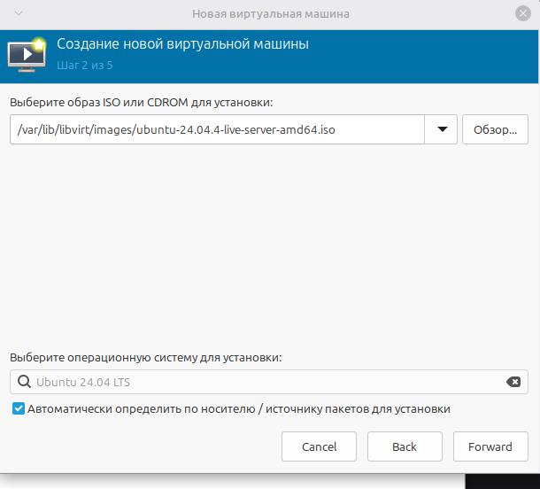
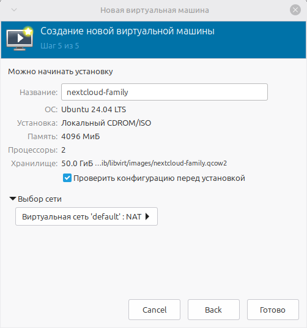

# Глава 2

## Содержание
   - [2.1 Установка пакетов](#21-установка-пакетов)
   - [2.2 Настройка прав libvirt и kvm](#22-добавляем-себя-в-группы-libvirt-и-kvm)
   - [2.3 Перезагрузка](#23-перезагрузка)
   - [2.4 Проверка](#24-проверка)
   - [2.5 Запуск virt-manager](#25-запуск-virt-manager)
   - [2.6 Создание новой ВМ](#26-создание-новой-вм)
   - [2.7 Запуск и установка Ubuntu Server](#27-запуск-и-установка-ubuntu-server)
   - [2.8 Первое подключение к ВМ](#28-первое-подключение-к-вм)
   - [2.9 Настройка автозапуска ВМ в virt-manager](#29-настройка-автозапуска-вм-в-virt-manager)
   - [2.10 Автозапуск через virsh](#210-альтернатива-через-virsh)

## Установка KVM + libvirt + virt-manager на сервере с Linux Mint

### 2.1 Установка пакетов

Откройте терминал на вашем Linux Mint и выполните:

```bash
# 1. Обновим список пакетов
sudo apt update

# 2. Установим всё необходимое одной командой
#    qemu-kvm и qemu-system-x86 — это "мотор"
#    libvirt-daemon-system и libvirt-clients — это "мозг" (сервис и утилиты)
#    bridge-utils — для сетевого моста (чтобы ВМ была полноценным членом вашей домашней сети)
#    virt-manager — это наш "пульт управления" (графическая программа)

sudo apt install -y qemu-kvm qemu-system-x86 libvirt-daemon-system libvirt-clients bridge-utils virt-manager
```

### 2.2 Добавляем себя в группы **libvirt** и **kvm**

Это нужно, чтобы управлять виртуалками без sudo (из-под своего пользователя).

```bash
# Добавляем текущего пользователя в группу libvirt
sudo usermod -aG libvirt $USER

# Добавляем текущего пользователя в группу kvm
sudo usermod -aG kvm $USER
```

### 2.3 Перезагрузка

> [!IMPORTANT]
> После добавления в группы нужно либо выйти из системы и зайти снова, либо перезагрузиться. Я рекомендую перезагрузиться, чтобы все службы стартанули правильно:

```bash
sudo reboot
```

### 2.4 Проверка

После перезагрузки откройте терминал и выполните:

```bash
# 1. Проверяем, что модуль KVM загружен и доступен
kvm-ok
```

Вы должны увидеть:

```text
INFO: /dev/kvm exists
KVM acceleration can be used
```

```bash
# 2. Проверяем статус службы libvirtd (она должна быть активна)
sudo systemctl status libvirtd
```

Должно быть написано **active (running)**.


```bash
# 3. Запускаем виртуальный менеджер (должна открыться программа)
virt-manager
```

Если открылось окно Virtual Machine Manager — всё отлично! Мы на месте.

## Создание виртуальной машины (ВМ)

Мы будем использовать **virt-manager** — графическую программу, которая уже установлена и готова к работе.

### 2.5 Запуск virt-manager

В терминале (или через меню приложений) выполните:

```bash
virt-manager
```

Откроется окно **Virtual Machine Manager**.

### 2.6 Создание новой ВМ

1. Нажмите на иконку «Создать новую виртуальную машину» (монитор с плюсиком) или в меню Файл → Новая виртуальная машина.
2. Выберите способ установки:
    - Выберите «Local install media (ISO image or CDROM)»
    - Нажмите «Forward»
3. Укажите ISO-образ Ubuntu Server:
    - Нажмите «Browse...»
    - В открывшемся окне нажмите «Browse Local» (если образ на вашем компьютере) и выберите скачанный ISO-файл Ubuntu Server (22.04 или 24.04 LTS)
    - Убедитесь, что в поле «OS type» выбрано Linux, а в «Version» — Ubuntu 22.04 (или 24.04)
    - Нажмите «Forward»
    - 

Если у вас нет ISO-образа, его можно скачать с официального сайта Ubuntu: https://ubuntu.com/download/server.

4. Настройте ресурсы ВМ:
    - RAM (Memory): 4096 MB (4 GB) — минимум для комфортной работы Nextcloud
    - CPU: 2 (можно выделить 2 ядра)
    - Нажмите «Forward»
5. Настройте диск:
    - Enable storage for this virtual machine — галочка должна стоять
    - Create a disk image on the computer's storage — выберите этот вариант
    - Size (GiB): 50 GB (для тестов этого хватит)
    - Нажмите «Forward»

> [!TIP]
> Если будет необходимо разместить ВМ на другом диске, подробно описано здесь: [Заключение, раздел 5.3](docs/conclusion.md#53-рекомендации-по-эксплуатации).

6. Итоговые настройки:
    - Name: введите осмысленное имя, например nextcloud-family (оно будет использоваться в virsh, если понадобится)
    - Network selection: в данной конфигурации выберите NAT (virbr0). Bridge не используется, так как хост находится в изолированном VLAN, и создание bridge может нарушить существующую сетевую изоляцию. Если будет необходимость использовать bridge, это возможно сделать так как bridge-utils был установлен вместе с пакетами KVM. (Так же я рекомендую NAT для простоты, а мост — если вы хотите, чтобы ВМ была полноценным членом вашей домашней сети с отдельным IP).
    - Остальные поля можно оставить по умолчанию
    - Нажмите «Finish»
    - 

### 2.7 Запуск и установка Ubuntu Server

ВМ запустится автоматически. Вас встретит окно с процессом загрузки ISO.

Установка Ubuntu Server (краткая схема):

1. Выберите язык (English)
2. Выберите Install Ubuntu Server
3. Настройте клавиатуру (обычно Russian или English (US))
4. Network connections: оставьте настройки DHCP по умолчанию (IP выдаст автоматически)
5. Proxy address: оставьте пустым
6. Mirror address: оставьте по умолчанию (http://archive.ubuntu.com/ubuntu)
7. Storage configuration: выберите Use an entire disk (единственный диск, который вы создали)
8. Profile setup:
    - Your name: Family Admin (или как хотите)
    - Your server's name: nextcloud-family (можно оставить предложенный)
    - Username: admin (или придумайте свой)
    - Password: придумайте надёжный пароль
9. Upgrade to Ubuntu Pro: выберите Skip for now (если не нужна платная подписка)
10. SSH Setup: выберите Install OpenSSH server (галочкой) — это позволит вам подключаться к ВМ по SSH
11. Featured Server Snaps: ничего не выбирайте, просто Continue
12. Установка начнётся. Дождитесь её завершения и нажмите Reboot Now

> [!TIP]
> Важно: при перезагрузке не забудьте «извлечь» ISO-образ, иначе ВМ снова загрузится с установочного диска. В virt-manager это делается через меню: Вид → Детали → IDE CDROM 1 → снять галочку «Connected».

### 2.8 Первое подключение к ВМ

После перезагрузки вы увидите консоль с приглашением ввести логин и пароль (те, что вы задали при установке).

Альтернативно, подключитесь по SSH (удобнее):
1. Узнайте IP вашей новой ВМ. В консоли ВМ выполните:

    ```bash
    ip a
    ```

    Найдите строку с inet (скорее всего, на интерфейсе eth0 или ens3). Это будет IP, например 192.168.122.10.
2. С вашего основного компьютера (хоста Linux Mint) подключитесь по SSH:

    ```bash
    ssh admin@192.168.122.10
    ```

    (Замените admin на ваше имя пользователя, а IP — на реальный)
    
3. При первом подключении подтвердите ключ (введите yes), затем введите пароль.

Поздравляю! Вы внутри свежеустановленного Ubuntu Server, готового к развёртыванию Nextcloud.

## Автоматический запуск ВМ

### 2.9 Настройка автозапуска ВМ в virt-manager

1. Откройте virt-manager.
2. Выберите вашу ВМ (Nextcloud) → Правой кнопкой → Свойства.
3. Перейдите на вкладку "Автозапуск".
4. Поставьте галочку "Включить автозапуск".
ДОБАВИТЬ СКРИНШОТ!

### 2.10 Альтернатива (через virsh)

```bash
sudo virsh autostart <имя_ВМ>
# Узнать имя ВМ
sudo virsh list --all
```