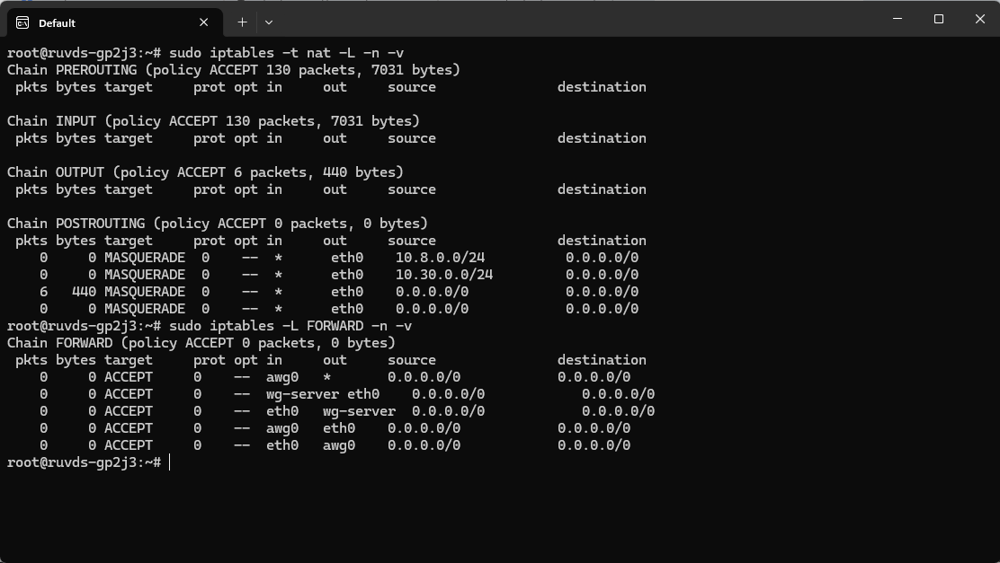
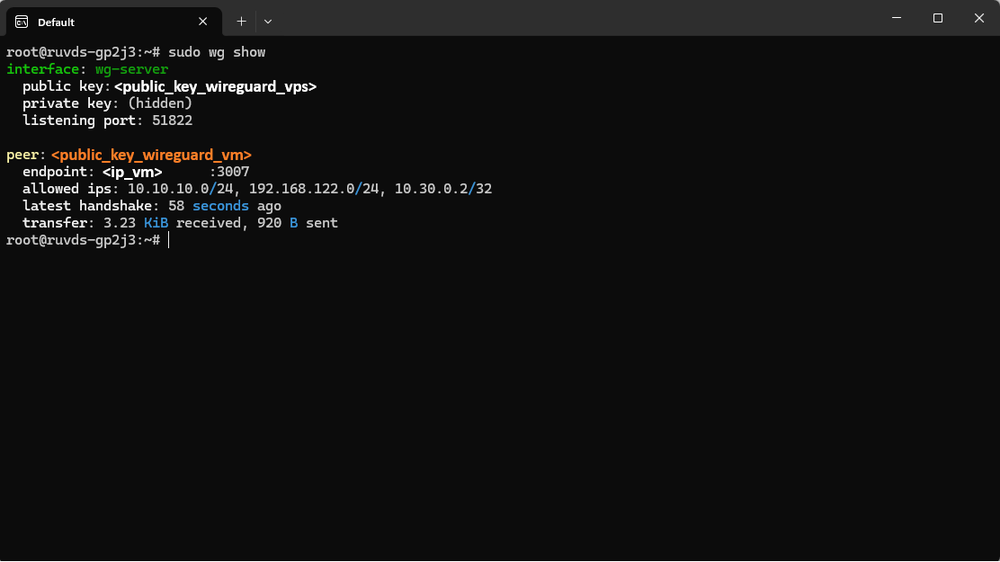
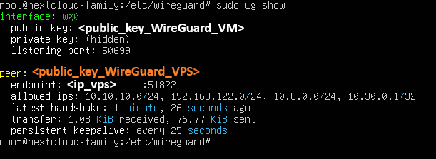

# Глава 3

## Содержание
  - [3.1 Установка WireGuard](#31-установка-wireguard)
  - [3.2 Создание конфигов для связи VPS ↔ ВМ](#32-создание-конфигов-для-связи-vps--вм)
  - [3.3 Настройка маршрутов и iptables на VPS](#33-настройка-маршрутов-и-iptables-на-vps)
  - [3.4 Запуск туннеля и проверка](#34-запуск-туннеля-и-проверка)
  - [3.5 Устранение неисправностей](#35-устранение-неисправностей)

## Установка и настройка WireGuard на VPS и ВМ

### 3.1 Установка WireGuard

#### На VPS (Ubuntu LTS 24.04):

```bash
sudo apt update && sudo apt install wireguard
```

#### На ВМ с Nextcloud (Ubuntu LTS 24.04):

```bash
sudo apt update && sudo apt install wireguard
```

### 3.2 Создание конфигов для связи VPS ↔ ВМ

#### На VPS (серверная часть):

```bash
# Переходим в директорию
cd /etc/wireguard

# Генерируем ключи (приватный и публичный)
sudo umask 077; sudo wg genkey | sudo tee server-privatekey | sudo wg pubkey | sudo tee server-publickey

# Создаём конфиг
sudo nano /etc/wireguard/wg-server.conf
```

Содержимое wg-server.conf:

```ini
[Interface]
PrivateKey = <содержимое server-privatekey>
Address = 10.30.0.1/24
ListenPort = 51822

[Peer]
PublicKey = <публичный_ключ_ВМ>
AllowedIPs = 10.10.10.0/24, 192.168.122.0/24, 10.30.0.2/32
```

<span style="color:red">**Важно:**</span>

- Публичный ключ ВМ (клиента) нужно получить на ВМ перед созданием конфига
- AllowedIPs должна включать сети 10.10.10.0/24 и 192.168.122.0/24, а также IP самой ВМ в туннеле 10.30.0.2/32

#### На ВМ с Nextcloud (клиентская часть):

```bash
# Переходим в директорию
cd /etc/wireguard

# Генерируем ключи
sudo umask 077; sudo wg genkey | sudo tee privatekey | sudo wg pubkey | sudo tee publickey

# Создаём конфиг
sudo nano /etc/wireguard/wg0.conf
```

Содержимое wg0.conf:

```ini
[Interface]
PrivateKey = <содержимое privatekey>
Address = 10.30.0.2/24

[Peer]
PublicKey = <публичный_ключ_VPS>
Endpoint = 194.87.74.111:51822
AllowedIPs = 10.10.10.0/24, 192.168.122.0/24, 10.8.0.0/24, 10.30.0.1/32
PersistentKeepalive = 25
```

<span style="color:red">**Важно:**</span>

- Публичный ключ VPS берётся из файла server-publickey
- AllowedIPs включает все необходимые сети: домашнюю (10.10.10.0/24), сеть ВМ (192.168.122.0/24), сеть телефона (10.8.0.0/24) и IP сервера в туннеле (10.30.0.1/32)
- PersistentKeepalive = 25 — критически важно для стабильности соединения

### 3.3. Настройка маршрутов и iptables на VPS

**Включаем IP forwarding**

```bash
sudo sysctl -w net.ipv4.ip_forward=1
echo "net.ipv4.ip_forward=1" | sudo tee -a /etc/sysctl.conf
```

**Добавляем правила iptables**

> [!TIP]
> **Примечание:** Если вы следовали Главе 1, правила для `awg0` (телефон) уже добавлены. Здесь мы **добавляем новые правила** для WireGuard-туннеля между VPS и ВМ (`wg-server` и подсеть `10.30.0.0/24`), а также проверяем, что старые правила на месте.

```bash
# Проверяем, что правила из Главы 1 уже есть
sudo iptables -t nat -L -n -v | grep -E "10.8.0.0|10.30.0.0"
sudo iptables -L FORWARD -n -v | grep awg0

# Добавляем NAT для трафика ВМ (если ещё нет)
sudo iptables -t nat -A POSTROUTING -s 10.30.0.0/24 -o eth0 -j MASQUERADE

# Добавляем форвардинг для WireGuard (VPS ↔ ВМ)
sudo iptables -A FORWARD -i wg-server -o eth0 -j ACCEPT
sudo iptables -A FORWARD -i eth0 -o wg-server -j ACCEPT

# Сохраняем правила
sudo apt install iptables-persistent -y
sudo netfilter-persistent save
```

**Проверка правил iptables**

Убедитесь, что все необходимые правила добавлены:

```bash
# Проверка NAT (masquerade)
sudo iptables -t nat -L -n -v | grep -E "10.8.0.0|10.30.0.0"

# Проверка форвардинга для AmneziaWG (телефон)
sudo iptables -L FORWARD -n -v | grep awg0

# Проверка форвардинга для WireGuard (VPS ↔ ВМ)
sudo iptables -L FORWARD -n -v | grep wg-server
```

Ожидаемый вывод должен показывать строки с `ACCEPT` и `MASQUERADE` для соответствующих подсетей и интерфейсов.

**Пример работающей конфигурации**

Ниже приведён скриншот вывода команд `iptables` с реально работающего сервера VPS. Все правила активны и обеспечивают маршрутизацию трафика между телефоном (AmneziaWG), интернетом и виртуальной машиной с Nextcloud.



### 3.4 Запуск туннеля и проверка

**Запуск на VPS**

```bash
sudo wg-quick up wg-server
sudo systemctl enable wg-quick@wg-server
```

**Запуск на ВМ**

```bash
sudo wg-quick up wg0
sudo systemctl enable wg-quick@wg0
```

### Проверка статуса

**На VPS:**

```bash
sudo wg show
```

Ожидаемый вывод (фрагмент):
```text
interface: wg-server
  public key: <публичный_ключ_VPS>
  listening port: 51822

peer: <публичный_ключ_ВМ>
  endpoint: 46.138.39.109:xxxxx
  allowed ips: 10.10.10.0/24, 192.168.122.0/24, 10.30.0.2/32
  latest handshake: X seconds ago
  transfer: X bytes received, X bytes sent
```



**На ВМ:**

```bash
sudo wg show
```

Ожидаемый вывод (фрагмент):

```text
interface: wg0
  public key: <публичный_ключ_ВМ>
  listening port: xxxxx (может быть любым, назначается системой)

peer: <публичный_ключ_VPS>
  endpoint: 194.87.74.111:51822
  allowed ips: 10.10.10.0/24, 192.168.122.0/24, 10.8.0.0/24, 10.30.0.1/32
  latest handshake: X seconds ago
  transfer: X bytes received, X bytes sent
  persistent keepalive: every 25 seconds
```



**Проверка пинга**

```bash
# С VPS до ВМ
ping -I wg-server 10.30.0.2

# С ВМ до VPS
ping -I wg0 10.30.0.1
Пинг должен идти в обе стороны без потерь.
```

### 3.5. Устранение неисправностей

|Проблема	                      |Решение                            |
|-------------------------------|----------------------------------|
|Нет handshake на VPS           |Проверьте, что в конфиге VPS указан правильный публичный ключ ВМ    |
|Пинг идёт только в одну сторону|Добавьте недостающие `allowed-ips` (особенно `10.30.0.2/32` на VPS и `10.30.0.1/32` на ВМ).
|Handshake есть, но соединение нестабильное или обрывается|Убедитесь, что в конфиге клиента (ВМ) указан `PersistentKeepalive = 25`
|Трафик не идёт, хотя handshake есть|	Проверьте правила `iptables` и маршруты на VPS
|Конфигурация сбрасывается после перезагрузки|Убедитесь, что включены автозапуск: `systemctl enable wg-quick@wg-server` и `systemctl enable wg-quick@wg0`
