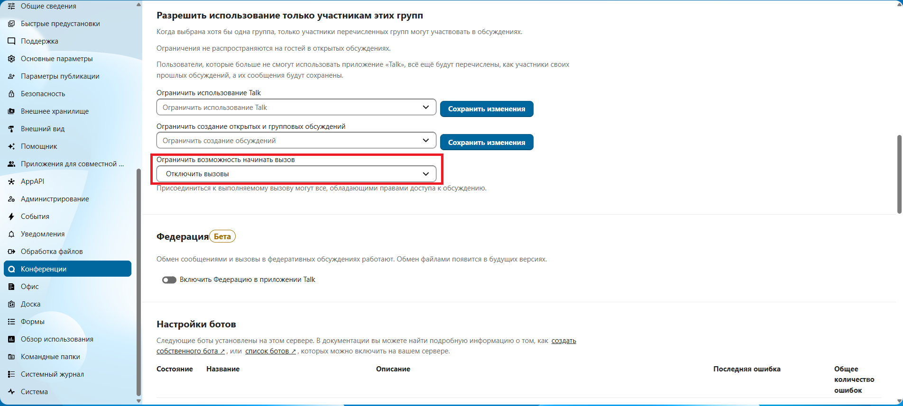

# Глава 4

## Содержание
  - [4.1 Два способа установки Docker и Docker Compose](#41-два-способа-установки-docker-и-docker-compose)
  - [4.2 Создание директории для Nextcloud](#42-создать-директорию-для-nextcloud-и-перейти-в-нее)
  - [4.3 Конфиг для docker](#43-конфиг-для-docker)
  - [4.4 Настройка Nextcloud через браузер](#44-настройте-nextcloud-через-браузер)
  - [4.5 Добавление trusted_domains](#45-добавьтеtrusted_domains)
  - [4.6 Автоматический запуск контейнеров Nextcloud](#46-автоматический-запуск-контейнеров-nextcloud)
  - [4.7 Проверка всей цепочки](#47-проверка-всей-цепочки)
  - [4.8 Что, если не работает?](#48-что-если-не-работает)

## Развертывание Nextcloud

### 4.1 Два способа установки Docker и Docker Compose

**Первый:**

```bash
sudo apt update && sudo apt upgrade -y
sudo apt install -y docker.io docker-compose
sudo usermod -aG docker $USER
newgrp docker
```

**Второй (официальный):**

```bash
# Удаляем старые версии (если были)
for pkg in docker.io docker-doc docker-compose docker-compose-v2 podman-docker containerd runc; do sudo apt-get remove $pkg; done

# Добавляем официальный репозиторий Docker
sudo apt-get update
sudo apt-get install ca-certificates curl
sudo install -m 0755 -d /etc/apt/keyrings
sudo curl -fsSL https://download.docker.com/linux/ubuntu/gpg -o /etc/apt/keyrings/docker.asc
sudo chmod a+r /etc/apt/keyrings/docker.asc

# Добавляем репозиторий в источники APT
echo \
  "deb [arch=$(dpkg --print-architecture) signed-by=/etc/apt/keyrings/docker.asc] https://download.docker.com/linux/ubuntu \
  $(. /etc/os-release && echo "$VERSION_CODENAME") stable" | \
  sudo tee /etc/apt/sources.list.d/docker.list > /dev/null
sudo apt-get update

# Устанавливаем Docker Engine + Compose V2 как плагин
sudo apt-get install docker-ce docker-ce-cli containerd.io docker-buildx-plugin docker-compose-plugin

# Добавляем пользователя в группу docker
sudo usermod -aG docker $USER
newgrp docker

# Проверяем
docker compose version
```

### 4.2 Создать директорию для nextcloud и перейти в нее

```bash
sudo mkdir nextcloud && cd nextcloud
```

### 4.3 Конфиг для docker

Открыть файл для конфига:

```bash
nano docker-compose.yml
```

Вставить конфиг:

```yaml
services:
  db:
    image: postgres:15
    restart: always
    volumes:
      - db_data:/var/lib/postgresql/data
    environment:
      - POSTGRES_PASSWORD=nextcloud
      - POSTGRES_USER=nextcloud
      - POSTGRES_DB=nextcloud
    networks:
      - nextcloud_network

  redis:
    image: redis:alpine
    restart: always
    networks:
      - nextcloud_network

  nextcloud:
    image: nextcloud:stable-apache
    restart: always
    ports:
      - "8080:80"
    volumes:
      - nextcloud_data:/var/www/html/data
      - nextcloud_config:/var/www/html/config
    environment:
      - POSTGRES_HOST=db
      - POSTGRES_USER=nextcloud
      - POSTGRES_PASSWORD=nextcloud
      - POSTGRES_DB=nextcloud
      - REDIS_HOST=redis
    depends_on:
      - db
      - redis
    networks:
      - nextcloud_network

networks:
  nextcloud_network:

volumes:
  db_data:
  nextcloud_data:
  nextcloud_config:
```

Запустить (в той же директории, где расположен конфиг):

```bash
docker-compose up -d
```

### 4.4 Настройте Nextcloud через браузер

- Откройте http://<vm_ip>:8080.
- Создайте администратора, установите Talk, отключите видеозвонки. Чтобы это сделать, нужно перейти в правом верхнем углу нажать на **пользователя → Параметры сервера → Конференции** и в разделе **"Разрешить использование только участникам этих групп" → Ограничить возможность начинать вызов → Отключить вызовы**



> [!TIP]
> **Важно:** Отключение вызовов полностью убирает видеосвязь и снижает нагрузку на сервер. Для текстового чата этого достаточно.

### 4.5 Добавьте trusted_domains

> [!IMPORTANT]
> **Примечание:** Имя контейнера может быть другим (например, `nextcloud-docker-nextcloud-1`). Узнайте точное имя командой `docker ps | grep nextcloud` и подставьте в команды ниже.

```bash
docker exec --user www-data nextcloud-nextcloud-1 php occ config:system:set trusted_domains 1 --value="<vm_ip>"
```

### 4.6 Автоматический запуск контейнеров Nextcloud

Docker автоматически запускается при старте системы (если установлен через `apt`). Проверьте:

```bash
sudo systemctl is-enabled docker
```

Если `disabled`, включите:

```bash
sudo systemctl enable docker
```

В `docker-compose.yml` уже есть `restart: always`

- restart: always означает, что контейнер будет автоматически запускаться при старте Docker (и, соответственно, при загрузке системы).

Проверьте, что контейнеры запускаются после перезагрузки:

```bash
sudo systemctl reboot
# После загрузки ВМ
docker ps
```

Контейнеры должны быть в статусе `Up`.

### 4.7 Проверка всей цепочки

1. Перезагрузите хост (Linux Mint).
2. Подключитесь к ВМ через SSH или virt-manager.
3. Проверьте, что контейнеры работают:

```bash
docker ps
```

4. Проверьте доступ к Nextcloud с хоста:

    ```bash
    curl http://<vm_ip>:8080
    ```

    Должен вернуться HTML-код страницы входа.

5. На телефоне включите VPN (AmneziaWG) и откройте `http://<vm_ip>:8080`. Должен открыться Nextcloud.

> [!TIP]
> **Примечание:** Перед проверкой убедитесь, что на телефон импортирован конфиг AmneziaWG (см. Главу 1, раздел 1.9).

### 4.8 Что, если не работает?

1. ВМ не запускается после перезагрузки хоста

    ```bash
    sudo virsh list --all
    ```

    Если ВМ остановлена, проверьте автозапуск.  

2. Контейнеры не стартуют после перезагрузки ВМ

    ```bash
    docker ps -a
    ```

    Если контейнеры остановлены, проверьте `restart: always`. Можно пересоздать стек:

    ```bash
    docker-compose up -d --force-recreate
    ```
