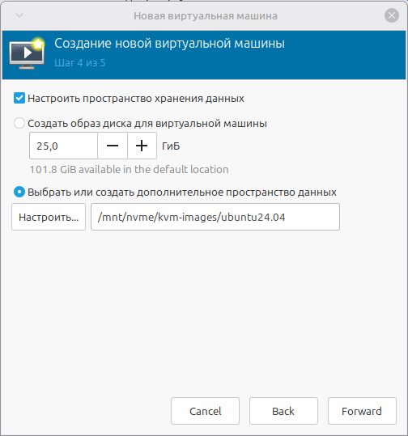
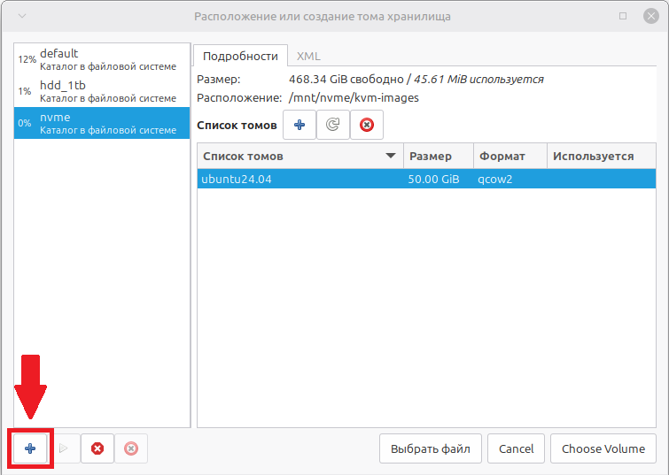
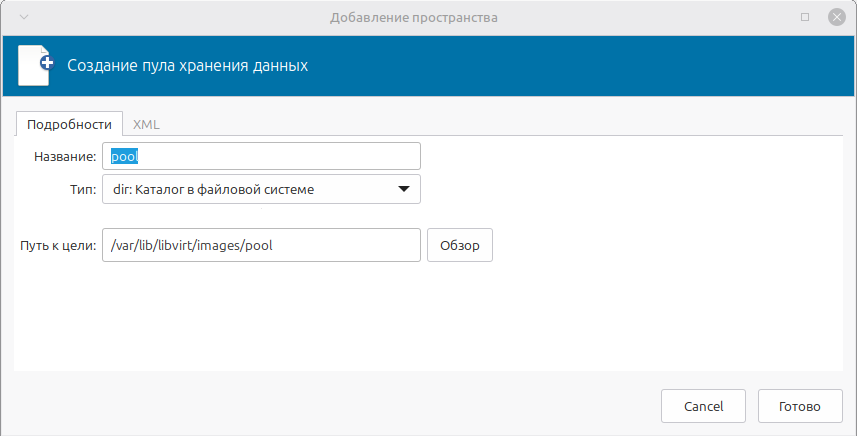
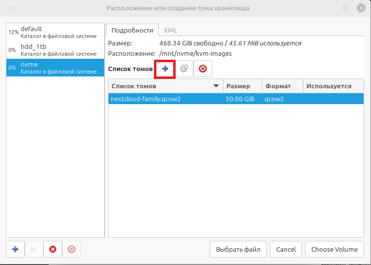

# Заключение

## Содержание
- [5.1. Результаты](#51-результаты)
- [5.2. Используемые конфиги](#52-используемые-конфиги)
- [5.3. Рекомендации по эксплуатации](#53-рекомендации-по-эксплуатации)
- [5.4. Устранение неисправностей (Troubleshooting)](#54-устранение-неисправностей-troubleshooting)
- [5.5 Дальнейшее развитие](#55-дальнейшее-развитие)
- [5.6 Ссылки](#56-ссылки)

### 5.1. Результаты

В ходе выполнения проекта был успешно развёрнут семейный облачный сервер на базе Nextcloud с защищённым доступом через AmneziaWG.

**Что удалось реализовать:**

- ☑️ Полностью изолированная инфраструктура (сервер в отдельном VLAN, доступ только через VPN)
- ☑️ Обход CGNAT и DPI-блокировок провайдера через VPS с AmneziaWG
- ☑️ Стабильный WireGuard-туннель между VPS и виртуальной машиной
- ☑️ Nextcloud с Docker-стеком (PostgreSQL, Redis, OnlyOffice)
- ☑️ Текстовый чат Nextcloud Talk (видеозвонки отключены)
- ☑️ Автоматический запуск ВМ и контейнеров после перезагрузки

### 5.2. Используемые конфиги

Все конфигурационные файлы, использованные в проекте, доступны в репозитории:

| Файл | Назначение | Конфиг |
|------|------------|------|
| `wg-server.conf` | WireGuard сервер на VPS | [wg-server.conf](configs/wg-server.conf) |
| `wg0.conf` | WireGuard клиент на ВМ | [wg0.conf](configs/wg0.conf) |
| `docker-compose.yml` | Развёртывание Nextcloud | [docker-compose.yml](configs/docker-compose.yml) |
| `awg-phone.conf.example` | Пример конфига AmneziaWG для телефона | [phone.conf](configs/phone.conf) |

### 5.3 Рекомендации по эксплуатации

#### Регулярное обслуживание

**Обновление системы на VPS и ВМ:**

```bash
sudo apt update
```
> [!TIP]
> Советую использовать команду `sudo apt upgrade -y` только после чистой установки и избегать ее после того, как все настроено, так как это может сломать систему. Используйте эту команду, только если уверены на 110%.

**Обновление Docker-контейнеров:**

```bash
cd ~/nextcloud
docker compose pull
docker compose up -d
```

**Проверка статуса VPN:**

```bash
sudo wg show      # WireGuard туннель VPS ↔ ВМ
sudo awg show     # AmneziaWG (телефон)
```

**Резервное копирование**

**Конфиги WireGuard:** `/etc/wireguard/`

**Конфиги AmneziaWG:** `/root/awg/`

**Данные Nextcloud:** Docker volumes (`db_data`, `nextcloud_data`, `nextcloud_config`)

**Вся ВМ:** снапшот через virt-manager или `virsh snapshot-create-as`

**Мониторинг**

Проверка handshake (туннель активен):

```bash
sudo wg show | grep "latest handshake"
```

Проверка доступности Nextcloud:

```bash
curl -I http://<vm_ip>:8080
```

---

#### Если необходимо разместить ВМ на другом диске (из [Главы 2](docs/chapter_2.md)):

#### Конфигурация хранилища
- **Хост-система:** 128 ГБ SSD (только для ОС)
- **Диск для ВМ:** NVMe 512 ГБ (монтируется в /mnt/nvme)

**Размещение образа ВМ**  
Путь: `/mnt/nvme/nextcloud-family.qcow2`  
Размер: 50 ГБ (выделяется динамически)

#### Настройка прав доступа к диску для создания ВМ

**Проблема**

При попытке создать виртуальную машину (ВМ) на дополнительном диске (NVMe, HDD), отличном от системного, можно получить ошибку доступа: `Permission denied`. Это происходит из-за особенностей работы KVM/libvirt.

**Почему так происходит?**

1. **Разные пользователи:** виртуальные машины на KVM/libvirt запускаются от имени специального пользователя `libvirt-qemu` (или `qemu`), а не от вашего.
2. **Права на «проход»:** чтобы процесс `libvirt-qemu` мог создать или открыть файл диска ВМ в папке, например `/mnt/nvme/kvm-images`, ему необходимо иметь право на **выполнение (execute, `--x`)** для **всех** папок по пути к ней. В нашем примере это папки `/mnt` и `/mnt/nvme`.
3.  **Права на запись:** сам файл диска (`nextcloud-family.qcow2`) и папка, где он лежит (`/mnt/nvme/kvm-images`), должны быть доступны пользователю `libvirt-qemu` для чтения и записи (`rwx`).

Проще говоря, KVM/libvirt нужны права, чтобы «пройти» через папку `/mnt/nvme` и создать там файл виртуального диска.

**Решение: пошаговая настройка прав**

> [!TIP]
> **Примечание:** Все команды выполняются на **хосте** (Linux Mint) от имени пользователя с правами `sudo`.

#### Шаг 1. Создайте папку для образов ВМ на целевом диске

Предположим, ваш NVMe диск примонтирован в `/mnt/nvme`.

```bash
# 1.1. Создаём папку для ВМ
sudo mkdir -p /mnt/nvme/kvm-images

# 1.2. Даём полные права на запись и чтение внутри этой папки
# Это нужно, чтобы libvirt-qemu мог создавать и изменять файлы дисков.
sudo chmod 777 /mnt/nvme/kvm-images
```

Почему `777`? Это самое простое и эффективное решение для тестового/домашнего окружения. Она даёт полный доступ всем пользователям. В изолированной домашней сети это безопасно.

#### Шаг 2. Предоставьте пользователю libvirt-qemu доступ ко всему пути

Это ключевой шаг. Выдаём права на «проход» (`--x`) для всех папок на пути к нашей папке с ВМ.

```bash
# Выдаём права на "проход" (execute) для всех пользователей на папку /mnt/nvme
sudo chmod o+x /mnt/nvme
```

#### Шаг 3. (Опционально) Настройте права через ACL

**ACL (Access Control Lists)** позволяют гибко настроить права для конкретного пользователя. Это страховка на случай, если предыдущих шагов оказалось недостаточно.

```bash
# 3.1. Убедимся, что пользователь libvirt-qemu существует
id libvirt-qemu

# 3.2. Даём пользователю libvirt-qemu права rwx на папку с ВМ
sudo setfacl -R -m u:libvirt-qemu:rwx /mnt/nvme/kvm-images

# 3.3. Даём пользователю libvirt-qemu право на "проход" (--x) для родительской папки
sudo setfacl -m u:libvirt-qemu:--x /mnt/nvme
```

- setfacl — утилита для управления расширенными списками доступа.
- -R — применяет правила рекурсивно для всех файлов и папок внутри kvm-images.
- u:libvirt-qemu:rwx — даёт пользователю libvirt-qemu права на чтение, запись и выполнение.
- u:libvirt-qemu:--x — даёт пользователю libvirt-qemu право на «проход» (--x), но не на чтение (-r-) или запись (-w-).

#### Шаг 4. Перезапустите службу libvirt

```bash
sudo systemctl restart libvirtd
```

**Проверка результата**

После выполнения всех команд вы можете быть уверены, что:

1. Пользователь libvirt-qemu имеет полный доступ к папке /mnt/nvme/kvm-images.
2. Пользователь libvirt-qemu имеет право «пройти» через папки /mnt и /mnt/nvme.

#### Создание ВМ на новом диске

**Создание виртуального диска (Storage Pool и Volume)**

На шаге 4 из 5 мастера создания ВМ необходимо создать выделенное пространство (pool) на быстром NVMe диске и разместить в нём файл виртуального диска.

1. В мастере создания ВМ на шаге "Шаг 4 из 5: Настройка хранилища":
    - Оставьте галочку "Настроить пространство хранения данных".
    - Выберите опцию "Выбрать или создать дополнительное пространство данных".
    - Нажмите кнопку "Manage..." (или "Настроить...").
    - > [!NOTE] На скриншотах пул и том уже созданы. Если делать с нуля, его не будет.
    - 
2. В открывшемся окне слева:
    - Нажмите на синий значок "+" (Добавить пул) в левом нижнем углу.
    - 
3. В окне создания пула заполните поля:
    - Название: nvme (можно выбрать любое имя).
    - Тип: dir (тип пула — просто папка в файловой системе).
    - Путь к цели: /mnt/nvme/kvm-images (путь к папке на вашем NVMe диске).
    - 
4. Нажмите "Finish" (Готово). Созданный пул nvme появится в списке слева.
    - Выберите этот пул nvme.
5. Теперь создайте файл виртуального диска (том):
    - Нажмите на синий значок "+" (Создание тома) сверху.
    - 
6. В окне создания тома заполните поля:
    - Название: nextcloud-family (имя файла диска).
    - Формат: qcow2 (оптимальный формат для KVM).
    - Ёмкость: 50 GiB (50 гигабайт с запасом для системы и данных).
    - Нажмите "Готово".
7. Выберите созданный том (nextcloud-family.qcow2) и нажмите "Choose Volume".
8. Нажмите "Forward" для перехода к шагу 5 из 5.

**Результат:** виртуальный диск создан и размещён на быстром NVMe диске в изолированном пуле хранения.

#### Полезные команды для диагностики прав

```bash
# Посмотреть, от имени какого пользователя запущен процесс libvirt
ps aux | grep libvirt

# Проверить права на папку с ВМ
ls -la /mnt/nvme/kvm-images

# Проверить расширенные права ACL (если использовали setfacl)
getfacl /mnt/nvme/kvm-images
getfacl /mnt/nvme
```

---

#### Управление AmneziaWG

**QR-код** можно не только сохранить, но и легко сгенерировать заново для любого количества устройств. После установки **AmneziaWG** на сервер у вас есть скрипт управления `manage_amneziawg.sh`, который позволяет управлять клиентами — добавлять новых, удалять, регенерировать конфиги и **QR-коды**.

#### Как добавить новый клиент (новое устройство).

Для каждого нового устройства (телефон жены, ноутбук ребёнка, ваш второй телефон) нужно создать отдельного клиента.

На сервере (VPS) выполните:

```bash
sudo bash /root/awg/manage_amneziawg.sh add <имя_клиента>
```

**Пример:**

```bash
sudo bash /root/awg/manage_amneziawg.sh add wife_phone
```

**Что произойдёт:**
- Скрипт сгенерирует новый ключ для клиента
- Добавит peer в конфиг сервера
- Создаст файлы /root/awg/wife_phone.conf и /root/awg/wife_phone.png (QR-код)

После добавления клиента обязательно перезапустите сервис:

```bash
sudo systemctl restart awg-quick@awg0
```

#### Как получить конфиг и QR-код для клиента

**Способ 1: QR-код (для телефона)**

Если вы зашли на сервер по **SSH** с компьютера, у которого есть графический интерфейс, можно отобразить QR-код прямо в терминале ASCII-графикой:

```bash
qrencode -t ansiutf8 < /root/awg/wife_phone.conf
```

Телефоном сканируете этот QR-код через приложение **AmneziaWG**.

> [!IMPORTANT]
>Важно: Если вы подключаетесь к серверу через SSH из консоли Windows (PowerShell), ASCII-графика может отображаться некорректно. В этом случае используйте **Способ 2**.

**Способ 2: Передать файлы через SCP (Windows/Linux)**

Скопируйте файлы с сервера на свой компьютер, а затем передайте их нужному человеку (по защищённому каналу).  
На вашем компьютере **(не на сервере!)**:

```powershell
# Windows (PowerShell) или Linux
scp root@<IP_сервера>:/root/awg/wife_phone.conf .
scp root@<IP_сервера>:/root/awg/wife_phone.png .
```

После этого вы можете:
- Отправить .conf файл человеку (через защищённый канал — Signal, Telegram с шифрованием, личная встреча на флешке)
- Показать QR-код (открыв .png файл) для сканирования телефоном

**Способ 3: Вывести конфиг в терминал и скопировать вручную**

```bash
cat /root/awg/wife_phone.conf
```

Скопируйте вывод и вставьте в приложение AmneziaWG на телефоне вручную.

**Как сгенерировать новый QR-код для существующего клиента (если потеряли)**

Если вы потеряли QR-код или `.conf` файл клиента, их можно создать заново без изменения ключей:

```bash
sudo bash /root/awg/manage_amneziawg.sh regen
```

Эта команда перегенерирует все `.conf` и `.png` файлы клиентов на основе текущей конфигурации сервера . После этого вы снова можете забрать файлы через `scp`.

**Полезные команды для управления клиентами**

|Команда	|Что делает|
|-----------|----------|
|sudo bash /root/awg/manage_amneziawg.sh list|	Показать всех клиентов и их статус|
|sudo bash /root/awg/manage_amneziawg.sh add <имя>|	Добавить нового клиента|
|sudo bash /root/awg/manage_amneziawg.sh remove <имя>|Удалить клиента
|sudo bash /root/awg/manage_amneziawg.sh regen|	Перегенерировать все конфиги и QR|
|sudo systemctl restart awg-quick@awg0|	Перезапустить сервис после добавления/удаления|

**Важное замечание**

После каждого добавления (`add`) или удаления (`remove`) клиента нужно перезапускать сервис:

```bash
sudo systemctl restart awg-quick@awg0
```

Без перезапуска новый клиент не сможет подключиться, а удалённый — продолжит висеть в памяти.

#### Итог
- Да, QR-код можно сохранить — файлы лежат в /root/awg/*.png
- Да, можно добавлять сколько угодно устройств — для каждого своё имя
- Да, можно восстановить утерянный конфиг — через regen
- Управление простое — один скрипт на всё

После того как добавите клиента и перезапустите сервис, можно сканировать **QR-код** приложением **AmneziaWG** на телефоне и подключаться.


### 5.4. Устранение неисправностей (Troubleshooting)

**Проблема:** медленный интернет при включённом AmneziaWG.

**Причина:** DPI-блокировка UDP-трафика на нестандартных портах.

**Решение:** сменить порт на `443` в конфиге сервера и телефона.

Настроить параметры обфускации в `/etc/amnezia/amneziawg/awg0.conf`:

```ini
Jc = 4
Jmin = 40
Jmax = 70
```

В конфиге телефона указать **DNS** `8.8.8.8`, `1.1.1.1`.

---

**Проблема:** Nextcloud не открывается по <vm_ip>:8080.

**Решение:** проверьте, что контейнеры запущены (`docker ps`).

Проверьте, что **IP ВМ** добавлен в `trusted_domains`.

Проверьте, что в конфиге телефона **AllowedIPs** включает сеть **ВМ** (Например `192.168.122.0/24`).

---

**Проблема:** ВМ не запускается после перезагрузки хоста.

**Решение:**

```bash
sudo virsh autostart <vm_name>
```

### 5.5 Дальнейшее развитие

- Перенос WireGuard на отдельный LXC-контейнер (VPN-шлюз) для масштабирования

- Добавление новых сервисов (Jellyfin, домашняя автоматизация) за тем же VPN-шлюзом

- Настройка IPv6 для полного обхода блокировок (если провайдер поддерживает)

### 5.6 Ссылки
- [Первый проект (настройка сервера и изоляция)](https://github.com/jetpackfm/mpd_server)

- [Официальный сайт AmneziaWG](https://amnezia.org/)

- [Документация WireGuard](https://www.wireguard.com/)

- [Nextcloud](https://nextcloud.com/)

- [RUVDS](https://ruvds.com/)
